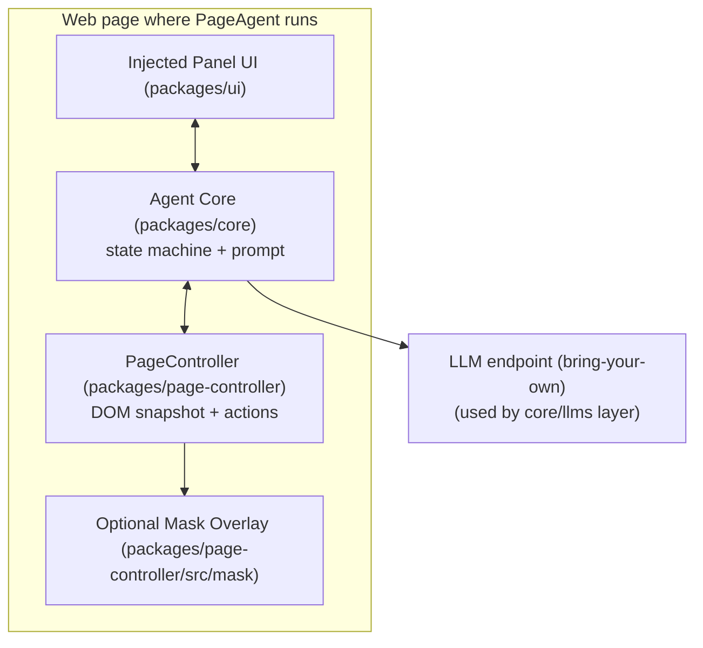
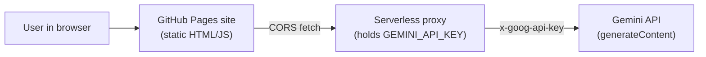

# Deep research report on page-agent and a Gemini-powered GitHub Pages demo

## Executive summary

entity["company","Alibaba Group","chinese tech conglomerate"]’s **page-agent** is a client-side “GUI agent living in your webpage”: it extracts a text-based representation of the current DOM (including indexed interactive elements) and then drives the page by simulating user interactions—without screenshots, headless browsers, or a required browser extension. citeturn39search0turn35view0

A key design choice is **in-page injection**: the project programmatically injects (1) an on-page control panel UI and (2) an optional “mask” overlay that blocks real user interaction during automation. The injection is done by building DOM nodes and appending them to `document.body`, with explicit IDs and marker attributes to identify/ignore agent-owned elements. citeturn20view10turn20view4turn17view0

For a **GitHub Pages–hosted demo**, page-agent’s own README explicitly supports a one-line `<script>` integration via an IIFE bundle distributed on a CDN, which is ideal for static hosting. citeturn39search0

For the **Gemini API**, entity["company","Google","us tech company"]’s official docs show:
- Authentication via an `x-goog-api-key` request header; example REST calls to `.../v1beta/models/<model>:generateContent`. citeturn47search2turn47search3  
- Rate limits are enforced per project, across RPM/TPM/RPD, with published free-tier tables for models including **Gemini 2.5 Flash**, **Gemini 2.5 Pro**, etc. citeturn47search0

Given that GitHub Pages is static and cannot safely store secrets, a rigorous demo architecture is: **Pages frontend + server-side proxy** (Worker/Functions/Run) that holds the Gemini key and exposes a minimal endpoint your page-agent-powered frontend can call. This avoids exposing the Gemini key in client JavaScript and lets you implement CORS controls. (This is a best-practice recommendation; the Gemini docs confirm API-key header usage but do not, by themselves, solve client-side key exposure.) citeturn47search2turn47search3

## Repository overview and architecture

### What page-agent is designed to do

The repository positions page-agent as an embedded agent to control web interfaces via natural language, emphasizing:
- **In-page JavaScript integration** (no Python/headless drivers required).
- **Text-based DOM manipulation** (no screenshots, not dependent on multimodal).
- **Bring your own LLMs** and a built-in UI with human-in-the-loop.
- Optional **Chrome extension** for multi-page tasks. citeturn39search0

The README also clarifies scope: it’s “client-side web enhancement,” not server-side automation. citeturn39search0

### Module decomposition visible in the source tree

The codebase is organized as multiple packages (monorepo style), with distinct responsibilities visible directly in the repository structure:
- `packages/page-controller/` — DOM extraction + action execution in the page context.
- `packages/ui/` — injected control-panel UI.
- `packages/core/` — agent loop logic and prompts (system prompt included).
- `packages/llms/` — LLM client layer (OpenAI-style client exists in this package name-space).
- `packages/website/` — the project’s website/demo app (Vite-based). citeturn7view0turn15view1turn18view0turn43view0turn45view0turn46view0

A practical architectural view (what actually runs in the browser) is:


citeturn20view10turn14view6turn17view0turn35view0turn39search0

## Installation, runtime requirements, and supported environments

### Quick-start options and packaging outputs

The README documents two main ways to integrate:

1) **One-line script integration**: include the IIFE build via a `<script>` tag and run using the “free Demo LLM” (for evaluation). citeturn39search0  
2) **NPM installation**: `npm install page-agent` and instantiate `PageAgent` in code with `{ model, baseURL, apiKey, language }`, then call `agent.execute(...)`. citeturn39search0turn39search3

The existence of `dist/iife/page-agent.demo.js` as a published artifact is implied by the official CDN links in README. citeturn39search0

### Runtime requirements implied by the code

Even without a dedicated “requirements” doc file in-repo, the runtime requirements are strongly implied by calls to browser globals:
- `window.location.href` and direct DOM APIs are used in `PageController` methods such as `getCurrentUrl()` and DOM tree refresh. citeturn14view6
- Both the UI panel and mask are created with `document.createElement()` and appended to `document.body`. citeturn20view4turn17view0

Therefore, the primary supported runtime environment is **a modern browser page context** (not Node.js-only), consistent with the README’s positioning (“Just in-page javascript. Everything happens in your web page.”). citeturn39search0turn14view6turn20view4

### Build tooling (relevant for GitHub Pages demos)

The project includes a Vite-based website package:
- `packages/website/index.html`
- `packages/website/vite.config.js`
- `packages/website/src/main.tsx`, `router.tsx`, etc. citeturn45view0turn46view0

This indicates the maintainers themselves use a modern bundler pipeline for at least the website/demo side.

## Source-code inspection of injection, initialization, and execution

This section focuses on **exact file paths** and the **mechanics** of how page-agent injects itself into an arbitrary page, how it extracts “LLM-readable” DOM state, and how it performs actions.

### Key files inspected and why they matter

The following concrete files are central to understanding injection/initialization:

- `packages/ui/src/panel/Panel.ts` — constructs and injects the UI wrapper element.
- `packages/page-controller/src/mask/SimulatorMask.ts` — constructs and injects the optional mask overlay.
- `packages/page-controller/src/PageController.ts` — coordinates DOM state refresh, mask initialization, and exposes methods like `showMask/hideMask`.
- `packages/page-controller/src/actions.ts` — user interaction simulation (click, input, etc).
- `packages/page-controller/src/dom/index.ts` and `packages/page-controller/src/dom/dom_tree/index.js` — DOM flattening and highlight mechanics.
- `packages/core/src/prompts/system_prompt.md` — “contract” for agent loop behaviors / limitations. citeturn19view0turn17view0turn13view0turn17view2turn16view6turn22view0turn35view0

### UI injection mechanics (panel)

**File:** `packages/ui/src/panel/Panel.ts`

The panel creates a wrapper with a stable ID and marker attributes, injects HTML UI markup, and appends it to `document.body`:

```ts
wrapper.id = 'page-agent-runtime_agent-panel'
wrapper.setAttribute('data-browser-use-ignore', 'true')
wrapper.setAttribute('data-page-agent-ignore', 'true')
document.body.appendChild(wrapper)
```
citeturn20view10turn20view4

**How it works step-by-step (conceptual):**
1. The panel constructs its wrapper element (`#createWrapper()`).
2. It assigns a deterministic `id` (`page-agent-runtime_agent-panel`) and marker attributes.
3. It sets `innerHTML` to the panel structure (history section, input, controls).
4. It appends the wrapper to `document.body`.
5. It wires event listeners and binds to the agent adapter; `dispose()` removes it and unregisters listeners. citeturn20view10turn20view4turn20view9

### Mask overlay injection mechanics

**File:** `packages/page-controller/src/mask/SimulatorMask.ts`

The mask overlay is a full-page interception layer (plus an “AI cursor”) built and mounted immediately:

```ts
this.wrapper.id = 'page-agent-runtime_simulator-mask'
this.wrapper.setAttribute('data-browser-use-ignore', 'true')
this.wrapper.setAttribute('data-page-agent-ignore', 'true')
document.body.appendChild(this.wrapper)
```
citeturn17view0

It also **captures** input events to block user interference by `stopPropagation()` and `preventDefault()` for clicks, mouse events, wheel events, and key events. citeturn17view0

The mask listens for custom events emitted by action code to animate the “AI cursor”:
- `PageAgent::MovePointerTo` to move cursor
- `PageAgent::ClickPointer` to show click ripple/animation citeturn17view0turn17view2

### Mask initialization timing and dynamic import

**File:** `packages/page-controller/src/PageController.ts`

`PageController` supports enabling the mask via configuration. The mask is initialized with a dynamic import:

```ts
if (config.enableMask) this.initMask()

const { SimulatorMask } = await import('./mask/SimulatorMask')
this.mask = new SimulatorMask()
```
citeturn14view6

The code comment explains the intent: “dynamic import to avoid CSS loading in Node.” citeturn14view6

Mask visibility is controlled via:

```ts
async showMask() { await this.maskReady; this.mask?.show() }
async hideMask() { await this.maskReady; this.mask?.hide() }
```
citeturn14view0turn14view6

### DOM extraction flow and how the panel/mask avoid interference

**File:** `packages/page-controller/src/PageController.ts`

When refreshing page state, `updateTree()`:
- announces update events,
- **temporarily bypasses mask pointer blocking** to allow extraction,
- cleans old highlights,
- builds a **blacklist** including anything marked `data-page-agent-not-interactive`,
- builds a flat tree and simplified HTML string,
- restores mask pointer blocking. citeturn14view6

A particularly important implementation detail is:

```ts
if (this.mask) this.mask.wrapper.style.pointerEvents = 'none'
// ...extract DOM...
if (this.mask) this.mask.wrapper.style.pointerEvents = 'auto'
```
citeturn14view6

This explains how a mask can exist during automation without preventing the agent itself from reading DOM state.

**File:** `packages/page-controller/src/dom/index.ts`

The flat-tree construction calls a `domTree(...)` function with:
- viewport expansion,
- interactive blacklist/whitelist,
- highlight opacity settings. citeturn32view0turn25view0

The DOM-to-text conversion (`flatTreeToString`) includes a default allowlist of attributes (e.g., `aria-label`, `role`, `value`, `placeholder`, etc.) to help the LLM reason about interactive elements and form state. citeturn30view8turn36view3

The same file explicitly includes a TODO about adding a “data masking filter,” indicating token/context safety is recognized as an open problem. citeturn30view1

### Highlighting and cleanup mechanics (avoiding persistent overlays)

**File:** `packages/page-controller/src/dom/dom_tree/index.js`

The DOM extraction tool also supports “highlight overlays” with a dedicated container:

```js
container.id = 'playwright-highlight-container'
container.style.zIndex = '2147483640'
document.body.appendChild(container)
```
citeturn33view1turn28view0

**File:** `packages/page-controller/src/dom/index.ts`

The repository includes a cleanup utility that calls stored cleanup functions and listens for navigation changes (popstate/hashchange/beforeunload) to clear highlight overlays. citeturn30view6turn31view3

### Action execution: click, input, and “unsafe” execution

**File:** `packages/page-controller/src/actions.ts`

Click simulation dispatches a realistic sequence of mouse events and triggers cursor animations via `PageAgent::ClickPointer`. citeturn17view2

For inputs, a key limitation is documented in-line: contenteditable support is partial; Monaco/CodeMirror and Draft.js patterns are explicitly called out as not universally supported. citeturn17view2

**File:** `packages/page-controller/src/PageController.ts`

There is an API to execute arbitrary JavaScript, implemented via `eval`:

```ts
const asyncFunction = eval(`(async () => { ${script} })`)
const result = await asyncFunction()
```
This is powerful, but also a significant security risk if untrusted text can reach this method. citeturn14view6

### Agent loop constraints come from the system prompt

**File:** `packages/core/src/prompts/system_prompt.md`

The system prompt includes explicit operational constraints such as:
- only interact with indexed elements,
- scrolling rules,
- and a notable limitation line: “You can only handle single page app. Do not jump out of current page.” citeturn35view0

This is important for a demo design: a GitHub Pages demo should be structured as a single-page exercise surface (forms, tables, modals) rather than a multi-site autonomous crawler.

## License, security considerations, and known limitations

### License and provenance

The repo is MIT-licensed. citeturn39search0

It also acknowledges that DOM processing components and prompts derive from the `browser-use` project, with attribution and MIT licensing noted in README. citeturn39search0

### Security-relevant behaviors visible in code

- **DOM injection:** both UI and mask append elements to `document.body`, and intercept user events, which can conflict with app-level event handling in some contexts. citeturn20view4turn17view0  
- **Arbitrary JS execution:** `executeJavascript` uses `eval` to run arbitrary script. If the agent can be prompted to run unsafe JS (or if you expose this method publicly), it becomes a code-execution vector. citeturn14view6  
- **Simulated input limitations:** complex editors (Monaco/CodeMirror) are a known hard case, so a production deployment should implement explicit “no-code-editor-typing” guardrails or specialized tool integrations. citeturn17view2  

### Known limitations (documented)

- **Single-page focus:** system prompt explicitly constrains the agent to a single page / avoid jumping. citeturn35view0  
- **Contenteditable/editor constraints:** partial contenteditable support; no universal approach for Monaco/CodeMirror. citeturn17view2  
- **Data masking is not fully implemented:** DOM-to-text utilities mention a TODO for data desensitization/masking. citeturn30view1  
- **DOM ignore attribute rename history:** release notes show a breaking change renaming a DOM ignore attribute from `data-browser-use-ignore` to `data-page-agent-ignore`, implying the project actively manages how injected elements are excluded from agent perception. citeturn37search0turn20view10turn17view0  

## Gemini API research and a GitHub Pages demo integration plan

### Official Gemini API essentials (primary sources)

**Authentication**
- Gemini API requests must include an `x-goog-api-key` header with the API key; the docs point to creating keys in Google AI Studio. citeturn47search2turn47search3

**Core endpoint**
- Example REST call format uses:  
  `https://generativelanguage.googleapis.com/v1beta/models/<model>:generateContent` citeturn47search2turn47search3

**API surface**
- The overview lists major endpoint families: `generateContent`, Live API (WebSocket, bi-directional), batch mode, embeddings, and platform utilities like file upload and token counting. citeturn47search3

**Rate limits / quotas**
- Rate limiting is described across RPM/TPM/RPD, applied **per project (not per API key)**, and tables vary by tier and model. citeturn47search0turn47search1
- The published free-tier table includes multiple currently-referenced models (Gemini 2.5 Pro/Flash/Flash-Lite, Gemini 2.0 Flash, etc.) with corresponding limits. citeturn47search0

### Model recommendation for this integration

For a page-agent demo, you typically want:
- low latency (fast turn-taking),
- enough reasoning quality to map DOM text → correct actions,
- enough RPM to support interactive testing by multiple users.

The official rate-limit table shows that, on Free tier, **Gemini 2.5 Flash** has higher RPM than **Gemini 2.5 Pro** (10 RPM vs 5 RPM) while sharing a high TPM cap, suggesting it is more suitable for “interactive demo” usage patterns. citeturn47search0

Recommendation:
- Default model for demo: **Gemini 2.5 Flash** (interactive, higher RPM in Free tier). citeturn47search0
- Optional “power mode”: switch to **Gemini 2.5 Pro** for tougher reasoning tasks, understanding that Free-tier RPM is lower. citeturn47search0

Cost/price note (scope limitation):
- The official pricing pages were not retrieved in the remaining browsing budget for this run, so this report avoids quoting token prices or making numeric cost claims. The rate-limits docs confirm that usage tiers tie to billing status and project spend, but they do not publish pricing. citeturn47search0turn47search1

### Example Gemini API calls (officially-aligned)

**REST curl (from official reference, model name can vary):**

```bash
curl "https://generativelanguage.googleapis.com/v1beta/models/gemini-2.5-flash:generateContent" \
  -H "x-goog-api-key: $GEMINI_API_KEY" \
  -H "Content-Type: application/json" \
  -X POST \
  -d '{
    "contents": [
      { "parts": [ { "text": "Explain how AI works in a few words" } ] }
    ]
  }'
```
citeturn47search2turn47search3

**Browser/Node fetch (pattern consistent with official docs):**
```js
async function generateContent({ apiKey, model, text }) {
  const url = `https://generativelanguage.googleapis.com/v1beta/models/${model}:generateContent`;
  const res = await fetch(url, {
    method: "POST",
    headers: {
      "Content-Type": "application/json",
      "x-goog-api-key": apiKey,
    },
    body: JSON.stringify({
      contents: [{ parts: [{ text }] }],
    }),
  });
  if (!res.ok) throw new Error(`${res.status}: ${await res.text()}`);
  return res.json();
}
```
citeturn47search2turn47search3

### Hosting constraints and workarounds for GitHub Pages

**Constraint:** GitHub Pages is static hosting. Any Gemini API key placed in front-end JavaScript is effectively public.

**Workaround (recommended):** Put the Gemini API key server-side and expose a controlled proxy endpoint to the GitHub Pages frontend. This is consistent with the Gemini docs’ requirement that requests carry an API key header; it does not provide a safe way to hide that key in the browser. citeturn47search2turn47search3

A robust demo deployment architecture:


citeturn47search2turn47search3

### Integration options comparison

| Option | How it works | Pros | Cons | When to choose |
|---|---|---|---|---|
| Direct browser → Gemini | Pages JS calls `generativelanguage.googleapis.com` with `x-goog-api-key` | Simplest code | API key exposure; difficult to enforce quotas per-user; CORS/preflight may vary | Only for local demos, never for public Pages |
| Pages + Gemini proxy (recommended) | Frontend calls your proxy; proxy adds `x-goog-api-key` and calls Gemini | Keeps key secret; can add auth, logging, abuse controls | Requires extra hosting component | Any public demo |
| Build an OpenAI-compatible proxy for page-agent | Keep page-agent config style (`baseURL`, `apiKey`) and translate to Gemini | Minimizes page-agent changes | Must implement enough compatibility for page-agent’s LLM calls | If you want zero fork of page-agent |
| Fork page-agent to add native Gemini client | Add a Gemini client beside existing LLM clients | Cleanest long-term integration | Requires maintaining a fork or contributing upstream | If you’re productizing and can invest |

(Compatibility and proxy behaviors are integration design recommendations; the Gemini docs cited cover authentication and endpoints but not proxy design.) citeturn47search2turn39search0

### Demo app plan for GitHub Pages

#### Repository structure

A practical repo layout that keeps the Pages portion static and deployable while keeping secrets out of the browser:

- `demo/` — Vite app that hosts a “sandbox page” with interactive widgets + initializes page-agent
- `proxy/` — serverless proxy code (Cloudflare Worker / Cloud Run / Functions) to call Gemini
- `.github/workflows/deploy-pages.yml` — builds `demo/` and publishes to GitHub Pages
- `README.md` — setup instructions (including how to deploy the proxy and configure its URL)

This mirrors how the upstream repo itself includes a Vite website package, suggesting a Vite-based approach is aligned with maintainer tooling. citeturn45view0turn46view0turn39search0

#### Build and deploy for GitHub Pages (Vite-based)

Key points (general practice):
- Set Vite `base` to `/<repo-name>/` for GitHub Pages.
- Ensure workflow publishes `demo/dist`.

Because the upstream project’s website is Vite-based, this is consistent with the repo’s own build choices. citeturn45view0turn46view0

#### Frontend code sample

This sample uses the **NPM integration path** described in page-agent README and points to a proxy URL you control (so you do not expose the Gemini key). citeturn39search0turn39search3

`demo/src/main.ts` (example)

```ts
import { PageAgent } from "page-agent";

// Your serverless proxy base URL, e.g. https://your-worker.example.com
const PROXY_BASE_URL = import.meta.env.VITE_LLM_BASE_URL;

async function main() {
  // Instantiate the in-page agent and panel UI.
  // Config keys and usage style follow the upstream README example.
  const agent = new PageAgent({
    model: "gemini-2.5-flash",
    baseURL: PROXY_BASE_URL,
    apiKey: "unused-by-proxy",
    language: "en-US",
  });

  // Option A: start the agent on a fixed task.
  const runBtn = document.getElementById("run")!;
  runBtn.addEventListener("click", async () => {
    const task = (document.getElementById("task") as HTMLInputElement).value.trim();
    if (!task) return;
    await agent.execute(task);
  });
}

main().catch((e) => console.error(e));
```

#### Proxy code sample (Gemini REST wrapper)

This is a minimal proxy that:
1) accepts a POST from the frontend,
2) calls `:generateContent` with `x-goog-api-key`,
3) returns the JSON response to the frontend with CORS headers.

The call format is per the official Gemini API reference/overview. citeturn47search2turn47search3

`proxy/worker.js` (illustrative)

```js
export default {
  async fetch(request, env) {
    // Basic CORS
    if (request.method === "OPTIONS") {
      return new Response(null, {
        headers: {
          "Access-Control-Allow-Origin": "*",
          "Access-Control-Allow-Methods": "POST, OPTIONS",
          "Access-Control-Allow-Headers": "Content-Type",
        },
      });
    }

    if (request.method !== "POST") {
      return new Response("Method not allowed", { status: 405 });
    }

    const { model, text } = await request.json();

    const url = `https://generativelanguage.googleapis.com/v1beta/models/${model}:generateContent`;

    const geminiRes = await fetch(url, {
      method: "POST",
      headers: {
        "Content-Type": "application/json",
        "x-goog-api-key": env.GEMINI_API_KEY,
      },
      body: JSON.stringify({
        contents: [{ parts: [{ text }] }],
      }),
    });

    const body = await geminiRes.text();

    return new Response(body, {
      status: geminiRes.status,
      headers: {
        "Content-Type": "application/json",
        "Access-Control-Allow-Origin": "*",
      },
    });
  },
};
```

**Important integration note for page-agent:** page-agent’s agent loop expects a model that can follow its prompt contract (indexed element operations, step loop, etc.). The system prompt documents constraints like “Only interact with elements that have a numeric [index] assigned.” citeturn35view0  
To make Gemini output compatible with page-agent’s loop, you must ensure:
- you pass page-agent’s full prompt/messages (not just a user sentence),
- and you return the model output in whatever format page-agent’s core expects.  
This report did not fully reconstruct page-agent’s LLM wire protocol (e.g., whether it requires OpenAI tool-calls or plain text) because the necessary LLM client code paths were not fully extracted within the tool-call budget; the README does confirm a “bring your own LLM” design and exposes `baseURL`/`apiKey` configuration. citeturn39search0

#### Timeline checklist for a working demo

- Define demo scope: single-page sandbox with forms/tables so the agent’s “single page” constraint is satisfied. citeturn35view0  
- Stand up proxy (Worker/Function) that calls Gemini `:generateContent` with `x-goog-api-key`. citeturn47search2turn47search3  
- Implement frontend:
  - Add interactive demo widgets (inputs, buttons, modal toggles).
  - Install `page-agent` and instantiate `PageAgent` as in README. citeturn39search0  
- Safety hardening:
  - Disable/guard arbitrary JS execution exposures (page-agent includes `executeJavascript` via `eval`). citeturn14view6  
  - Add action allow/deny rules in your prompt layer (inspired by the repo’s security posture and prompt contract). citeturn35view0  
- Deploy:
  - Build Vite app and publish to GitHub Pages.
  - Configure environment variables for the proxy URL on the frontend side and Gemini key on proxy side.
- Load test within Gemini quotas:
  - Validate RPM/TPM based on model and tier (Free tier table is published). citeturn47search0  

## Referenced pages and files

The following are the primary sources used. URLs are listed in code blocks to satisfy environments that restrict raw links in prose.

```text
Repo (code + README)
- https://github.com/alibaba/page-agent
- https://github.com/alibaba/page-agent/blob/main/README.md
- https://github.com/alibaba/page-agent/blob/main/packages/ui/src/panel/Panel.ts
- https://github.com/alibaba/page-agent/blob/main/packages/page-controller/src/PageController.ts
- https://raw.githubusercontent.com/alibaba/page-agent/main/packages/page-controller/src/mask/SimulatorMask.ts
- https://raw.githubusercontent.com/alibaba/page-agent/main/packages/page-controller/src/actions.ts
- https://github.com/alibaba/page-agent/blob/main/packages/page-controller/src/dom/dom_tree/index.js
- https://github.com/alibaba/page-agent/blob/main/packages/page-controller/src/dom/index.ts
- https://github.com/alibaba/page-agent/blob/main/packages/core/src/prompts/system_prompt.md
- https://github.com/alibaba/page-agent/releases
- https://github.com/alibaba/page-agent/tree/main/packages/website
- https://github.com/alibaba/page-agent/tree/main/packages/website/src

Gemini API (official)
- https://ai.google.dev/api
- https://ai.google.dev/docs/gemini_api_overview/
- https://ai.google.dev/gemini-api/docs/quota
- https://ai.google.dev/gemini-api/docs/rate-limits
```